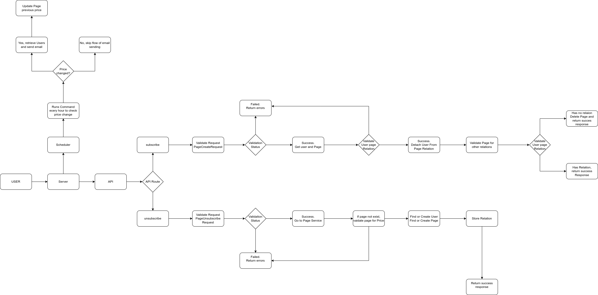

# Laravel Ad Subscriber Application

Project set up and start.

Main .env parameters exists in the file, for database connection- 
```http
  cp .env.example .env - use this command to create .env file
``` 

To start the project we need to follow this steps:

1) Install composer:
```http
  composer install
```

2) Create laravel sail enviroment for easy usage:
```http
  php artisan sail:install - after runing this command select only mysql
```

3) Start docker:
```http
  ./vendor/bin/sail up -d
```

4) Run migration of database:
```http
  ./vendor/bin/sail artisan migrate
```
# API Documentation:
List of the existed API:
```http
  POST /api/page/subscribe
```

| Parameter  | Type     | Description                                                                     |
|:-----------| :------- |:--------------------------------------------------------------------------------|
| `page_url` | `string` | **Required**. URL of the OLX page where we shoul track the price change.        |
| `email`    | `string` | **Required**. Email of the User where to send notification about price changes. |


```http
  DELETE /api/page/unsubscribe
```

| Parameter  | Type     | Description                                                        |
|:-----------| :------- |:-------------------------------------------------------------------|
| `page_url` | `string` | **Required**. URL of the OLX page to unsubscribe.                  |
| `email`    | `string` | **Required**. Email of the User to unsubscribe from notifications. |


##
# Main logic path
```http
  Name | Path:

  subscribe & unsubscribe api | routes/api.php

  PageController | Http/Controllers/Api/PageSubscribeController.php

  PageService | Services/PageService.php

  PriceChangeObserverCommand | Console/Commands/PriceChangeObserverCommand.php

  PriceChangesEmailNotification | Notifications/Page/PriceChangesEmailNotification.php
  
  CrawlService | Services/CrawlService.php
```


##
# Application Diagram

